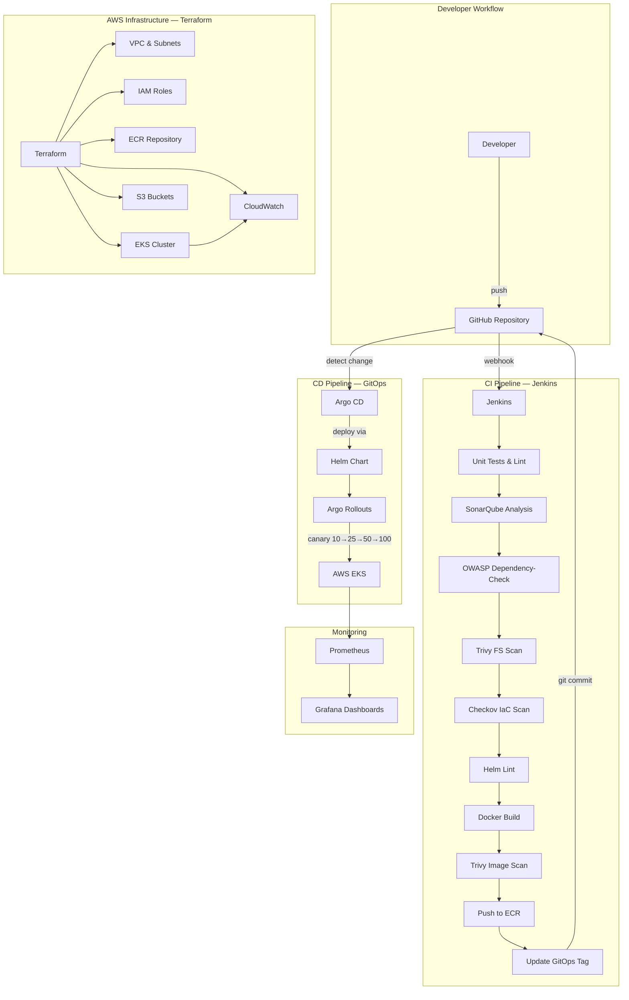

correct my read me .md ffile <
- [Architecture](#-architecture)
- [Technology Stack](#-technology-stack)
- [ML & MLOps Pipeline](#-ml--mlops-pipeline)
- [Prerequisites](#-prerequisites)
- [Quick Start — Local Development](#-quick-start--local-development)
- [Infrastructure Deployment (Terraform)](#-infrastructure-deployment-terraform)
- [EKS & Helm Deployment](#-eks--helm-deployment)
- [Jenkins CI Pipeline](#-jenkins-ci-pipeline)
- [Argo CD GitOps](#-argo-cd-gitops)
- [Argo Rollouts — Progressive Delivery](#-argo-rollouts--progressive-delivery)
- [Security Scanning](#-security-scanning)
- [Monitoring & Observability](#-monitoring--observability)
- [Troubleshooting](#-troubleshooting)
- [Cleanup](#-cleanup)
- [Attribution & Contributions](#-attribution--contributions)

---

## 🎯 Project Overview

**Problem**: Malicious URLs are used in phishing, social engineering, and malware attacks. This system uses ML to classify URLs as **Safe**, **Suspicious**, or **Malicious** based on 30 extracted features.

**Solution**: A production-grade platform combining:
- **ML Pipeline** — Data ingestion (MongoDB) → Validation → Transformation → Model Training (RandomForest) → MLflow tracking → S3 artifact storage
- **Serving** — FastAPI (batch predictions) + Streamlit (real-time single-URL predictions)
- **Infrastructure** — Terraform-provisioned AWS (VPC, EKS, ECR, S3, IAM, CloudWatch)
- **CI/CD** — Jenkins CI → Docker → ECR → Argo CD GitOps → Helm → Argo Rollouts (Canary)
- **Security** — Trivy, Checkov, SonarQube, OWASP Dependency-Check
- **Observability** — Prometheus + Grafana (app/cluster) + CloudWatch (AWS infra)

---

## 🏗 Architecture



---

## 🛠 Technology Stack

| Category | Technology | Purpose |
|---|---|---|
| **ML/AI** | Scikit-learn, MLflow, Pandas, NumPy | Model training, experiment tracking |
| **Backend** | FastAPI, Uvicorn | Batch prediction API + training trigger |
| **Frontend** | Streamlit | Real-time URL prediction UI |
| **Database** | MongoDB Atlas | ML training data storage |
| **Orchestration** | Apache Airflow | Training & prediction DAGs |
| **Containerization** | Docker | Multi-stage production builds |
| **IaC** | Terraform (modular) | AWS infrastructure provisioning |
| **Cloud** | AWS (VPC, EKS, ECR, S3, IAM, CloudWatch) | Production cloud platform |
| **CI** | Jenkins | Automated testing, scanning, building |
| **CD/GitOps** | Argo CD | Git-based deployment to EKS |
| **Progressive Delivery** | Argo Rollouts | Canary deployments (10→25→50→100%) |
| **Packaging** | Helm | Kubernetes application packaging |
| **Security — Container** | Trivy | Filesystem & Docker image scanning |
| **Security — IaC** | Checkov | Terraform & K8s manifest scanning |
| **Security — Code** | SonarQube | Code quality & vulnerability analysis |
| **Security — Dependencies** | OWASP Dependency-Check | Known CVE detection |
| **Monitoring — App** | Prometheus + Grafana | Pod metrics, HTTP metrics, dashboards |
| **Monitoring — Infra** | AWS CloudWatch | EKS logs, node health, alarms |

---

## 🧠 ML & MLOps Pipeline

1. **Data Ingestion** — Fetch from MongoDB → Feature store → Train/test split
2. **Data Validation** — Schema checks, data drift detection (KS test)
3. **Data Transformation** — KNNImputer preprocessing → NumPy arrays
4. **Model Training** — GridSearchCV across RandomForest, GradientBoosting, DecisionTree, LogisticRegression, AdaBoost
5. **Experiment Tracking** — MLflow logs F1-score, Precision, Recall
6. **Artifact Storage** — Models & preprocessors synced to AWS S3
7. **Serving** — FastAPI `/train` and `/predict` routes + Streamlit UI

---

## 📦 Prerequisites

- Python 3.10+
- Docker & Docker Compose
- AWS CLI (configured)
- Terraform >= 1.5
- Helm 3
- kubectl
- Jenkins server (with plugins: Docker, SonarQube, OWASP, Pipeline)
- Trivy, Checkov (for local scanning)

---

## 🚀 Quick Start — Local Development

```bash
# Clone
git clone https://github.com/Rohit001001/Automated-Cyber-Threat-Detection-System-with-AI-MLOps.git
cd Automated-Cyber-Threat-Detection-System-with-AI-MLOps

# Configure environment
cp .env.example .env
# Edit .env with the required local environment values.
# Never commit .env or credentials to Git.

# Run with Docker Compose
docker compose up --build

# Access
# FastAPI:   http://localhost:8080/docs
# Health:    http://localhost:8080/health

# Or run locally
pip install -r requirements.txt
python app.py                    # FastAPI on :8080
streamlit run streamlit.py       # Streamlit UI
```

---

## 🏗 Infrastructure Deployment (Terraform)

```bash
cd terraform
cp terraform.tfvars.example terraform.tfvars
# Edit terraform.tfvars with your values

terraform init
terraform fmt -recursive
terraform validate
terraform plan
terraform apply    # Requires AWS credentials configured
```

**Provisioned resources**: VPC, public/private subnets, NAT Gateway, EKS cluster, managed node group, ECR repository, S3 buckets, IAM roles, CloudWatch log groups & alarms.

---

## ☸ EKS & Helm Deployment

```bash
# Configure kubectl
aws eks update-kubeconfig --region us-east-1 --name network-security-mlops-dev

# Deploy with Helm
helm install network-security helm/network-security-mlops/ \
  --namespace network-security --create-namespace \
  --values helm/network-security-mlops/values-dev.yaml

# Verify
kubectl get pods -n network-security
kubectl port-forward svc/network-security-network-security-mlops 8080:8080 -n network-security
```

---

## 🔄 Jenkins CI Pipeline

The `Jenkinsfile` defines 15 stages. Configure these Jenkins credentials:

| Credential ID | Type | Purpose |
|---|---|---|
| `AWS_REGION` | Secret text | AWS region |
| `AWS_ACCOUNT_ID` | Secret text | AWS account ID |
| `AWS_ACCESS_KEY_ID` | Secret text | AWS access key |
| `AWS_SECRET_ACCESS_KEY` | Secret text | AWS secret key |
| `GITHUB_TOKEN` | Secret text | GitHub PAT for GitOps commits |

**Pipeline flow**: Checkout → Lint → Tests → SonarQube → OWASP → Trivy FS → Terraform validate → Checkov → Helm lint → Docker build → Trivy image → ECR push → GitOps update

---

## 🔄 Argo CD GitOps

```bash
# Install Argo CD + Argo Rollouts (see argocd/README.md)
kubectl apply -f argocd/project.yaml
kubectl apply -f argocd/application.yaml
```

**Workflow**: Jenkins updates image tag in `values.yaml` → Argo CD detects → auto-syncs to EKS

---

## 🚢 Argo Rollouts — Progressive Delivery

Canary strategy: **10% → pause → 25% → pause → 50% → pause → 100%**

Automated analysis queries Prometheus for HTTP success rate (≥95%) before promotion. Enable with `rollouts.enabled: true` in values.

See [docs/rollback-procedures.md](docs/rollback-procedures.md) for rollback steps.

---

## 🔒 Security Scanning

| Tool | Scope | Integration |
|---|---|---|
| **Trivy** | Filesystem + Docker images | Jenkins pipeline stages |
| **Checkov** | Terraform, K8s manifests, Helm | Jenkins + `scripts/checkov-scan.sh` |
| **SonarQube** | Python code quality | Jenkins (when configured) |
| **OWASP** | Python dependency CVEs | Jenkins pipeline stage |

See [docs/checkov-exceptions.md](docs/checkov-exceptions.md) for documented scan suppressions.

---

## 📊 Monitoring & Observability

| System | Scope | Access |
|---|---|---|
| **Prometheus + Grafana** | Pod health, CPU, memory, HTTP metrics | `kubectl port-forward svc/prometheus-grafana -n monitoring 3000:80` |
| **AWS CloudWatch** | EKS control plane logs, node health, alarms | AWS Console |

See [docs/monitoring-responsibilities.md](docs/monitoring-responsibilities.md) for detailed breakdown.

---

## 🔧 Troubleshooting

```bash
# Check pod status
kubectl get pods -n network-security
kubectl describe pod <pod-name> -n network-security
kubectl logs <pod-name> -n network-security

# Check Argo CD sync status
argocd app get network-security-mlops

# Check rollout status
kubectl argo rollouts status <rollout-name> -n network-security

# Terraform state
cd terraform && terraform show
```

---

## 🧹 Cleanup

```bash
# Remove Kubernetes resources
helm uninstall network-security -n network-security
kubectl delete -f argocd/application.yaml
kubectl delete -f argocd/project.yaml

# Destroy AWS infrastructure
cd terraform && terraform destroy

# Remove Docker images
docker system prune -af
```

---

## 📜 Attribution & Contributions

### Original Project
This repository extends the **Automated Cyber Threat Detection System with AI & MLOps** originally developed by Aman Agnihotri. The original ML pipeline, feature extraction, model training, FastAPI/Streamlit serving, Airflow orchestration, and MLflow integration were created by the original author.

### Engineering Enhancements by Rohit

The following DevOps, Cloud, GitOps, security, and observability enhancements were added on top of the original ML application:

| Enhancement | Description |
|---|---|
| **Jenkins CI Pipeline** | 15-stage production pipeline replacing GitHub Actions |
| **Terraform IaC** | Modular AWS infrastructure (VPC, EKS, ECR, S3, IAM, CloudWatch) |
| **AWS EKS Deployment** | Kubernetes-native application deployment |
| **Helm Packaging** | Reusable, configurable Kubernetes charts with multi-env support |
| **Argo CD GitOps** | Git-based continuous deployment with auto-sync |
| **Argo Rollouts** | Canary progressive delivery (10→25→50→100%) with automated analysis |
| **Trivy Security** | Filesystem and container image vulnerability scanning |
| **Checkov IaC Security** | Terraform and Kubernetes security compliance scanning |
| **SonarQube Integration** | Code quality and vulnerability analysis |
| **OWASP Dependency-Check** | Known CVE detection in Python dependencies |
| **Prometheus + Grafana** | Application and cluster observability |
| **AWS CloudWatch** | Infrastructure monitoring and alerting |
| **Production Dockerfile** | Multi-stage build, non-root user, health checks |
| **Security Hardening** | Removed hardcoded credentials, comprehensive .gitignore, K8s security contexts |
